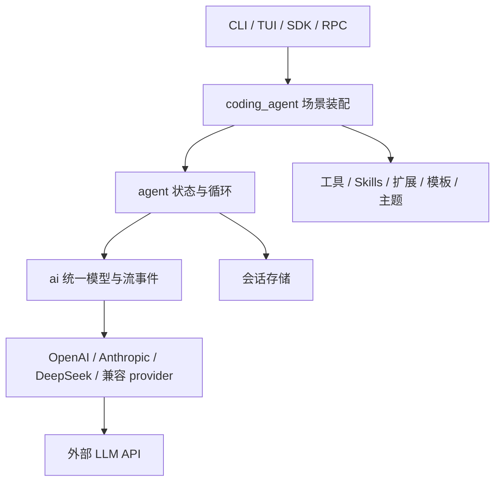
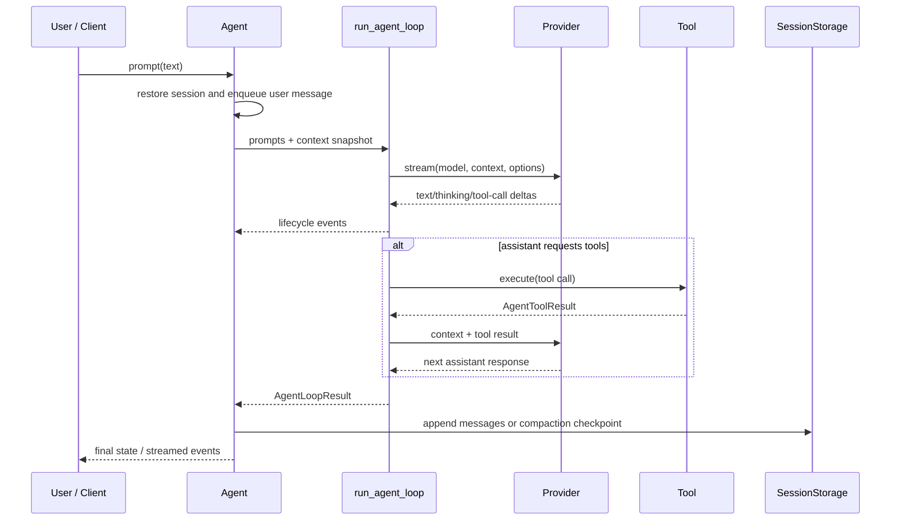

# 项目架构

## 1. 项目定位

piY 是一个运行在终端中的 Python AI 编码 agent。它把不同 LLM provider 的协议差异
收敛为统一的消息和事件模型，在其上实现工具调用循环、会话恢复、上下文压缩，并通过
CLI、TUI、SDK 和 JSONL RPC 对外提供能力。

项目使用 Python 3.12+，采用 `src` 布局，主包位于 `src/pi`。

## 2. 分层与依赖方向

依赖原则是上层组合下层，下层不依赖具体交互界面：

| 层 | 目录 | 责任 |
| --- | --- | --- |
| LLM 抽象层 | `src/pi/ai` | 定义模型、消息、工具、用量和流事件；适配 provider；管理模型与凭据 |
| Agent 内核层 | `src/pi/agent` | 驱动模型与工具循环；维护状态；排队、取消、压缩和会话存储 |
| 编码场景层 | `src/pi/coding_agent` | 装配工具和系统提示；加载项目资源；提供 CLI、SDK 与 RPC |
| 终端交互层 | `src/pi/tui` | 输入、选择器、流式渲染、状态栏和交互命令 |

## 3. 核心模块

### 3.1 LLM 抽象层

`pi.ai.types` 是 provider 之间的公共语言，包含：

- `Model`：provider、API 类型、上下文窗口、输出上限和成本等模型元数据。
- `UserMessage`、`AssistantMessage`、`ToolResultMessage`：统一消息协议。
- `TextContent`、`ThinkingContent`、`ToolCall`：结构化内容块。
- `StreamOptions`：温度、输出长度、重试、取消、思考级别等请求选项。

`BaseProvider.stream()` 接收统一的 `Model`、`Context` 和 `StreamOptions`，返回
`EventStream`。具体 provider 负责协议转换、鉴权、HTTP 请求和增量响应解析，必须以
`DoneEvent` 或 `ErrorEvent` 结束事件流。

内置 provider 由 `pi.ai.providers.registry` 注册。OpenAI 兼容 provider 复用
`OpenAIProvider`，Anthropic 保持独立适配，DeepSeek 在 OpenAI 协议基础上定制。

### 3.2 Agent 内核层

这一层包含两个不同职责的核心对象：

- `run_agent_loop()` 是单次任务的循环执行器，负责调用模型、接收流事件、执行工具并
  回填工具结果。
- `Agent` 是有状态包装器，负责长期消息状态、事件订阅、会话持久化、模型切换、取消、
  steering 和 follow-up 队列。

这种拆分让循环逻辑可通过假的 `stream_fn` 和工具独立测试，也让 CLI、SDK、RPC 可以
共享同一个状态模型。

`AgentTool` 把发送给模型的 JSON Schema 与本地异步 `execute` 函数绑定。
`ToolContext` 提供工作目录和运行时状态，避免工具直接依赖某个界面实现。

`subagent` 是建立在同一 `Agent` 抽象上的组合工具。子代理拥有独立循环和内存会话，继承
父代理的模型请求函数及生成参数，并共享工作目录。默认 `analysis` 模式只提供 read、ls、
find、grep；`full` 模式才提供写入、命令和继续派生子代理的能力。当前最大嵌套深度为 2，
默认最多运行 8 次模型调用，最终回答作为普通工具结果回到主代理上下文。

### 3.3 编码场景层

`pi.coding_agent.runtime` 是组合根。它负责：

1. 创建内置编码工具。
2. 加载显式扩展及其工具、provider、模型、命令和提示片段。
3. 发现 Skills、Prompt Templates、上下文文件和主题。
4. 按固定顺序拼装系统提示词。
5. 创建按模型动态路由 provider 的 `stream_fn`。

`pi.coding_agent.sdk.create_coding_agent()` 在此基础上创建 `CodingAgent`，并可选接入
JSONL 会话存储。CLI、RPC 等入口应尽量复用这个装配逻辑，避免产生能力不同的平行运行时。

### 3.4 交互与嵌入接口

- CLI 入口：`pi.coding_agent.cli:main`，安装后命令为 `piY`。
- TUI：`InteractiveSession`，处理终端输入、流式输出和会话内命令。
- SDK：`create_coding_agent()` 和 `CodingAgent`，用于 Python 程序内嵌。
- RPC：基于 stdin/stdout 的 JSONL 协议，支持 prompt、steer、follow-up、abort、
  get_state、set_model 和 shutdown。

## 4. 一次请求的生命周期

详细规则如下：

1. `Agent.prompt()` 恢复会话，把新用户消息与历史快照交给 `run_agent_loop()`。
2. 循环在 provider 边界把 `AgentMessage` 转换为统一的 LLM `Message`。
3. provider 的文本、思考和重试增量被转换成 agent 生命周期事件，订阅者可实时渲染。
4. 若助手返回工具调用，默认使用 `asyncio.gather()` 并行执行同一轮工具；结果按原调用
   顺序回填。可通过 `ToolExecutionMode.SEQUENTIAL` 切换为串行。
5. 没有工具调用且没有 steering 消息时，本次循环结束；follow-up 由 `Agent` 发起下一轮。
6. 取消信号同时作用于 provider 流和正在执行的工具任务。

## 5. 上下文与会话

### 5.1 上下文压缩

上下文预算默认由模型 `context_window` 减去预留输出 token 得到。超过预算时，agent 会：

1. 保留近期完整轮次，选择需要丢弃的早期轮次。
2. 调用当前模型生成结构化摘要。
3. 将摘要作为合成的用户消息与近期消息组合成新上下文。
4. 若摘要请求失败，退回确定性的截断压缩，确保主任务仍能继续。

模型也可以调用自动注入的 `compact` 工具主动请求压缩。

### 5.2 会话存储

`SessionStorage` 是抽象接口，当前实现包括内存存储和 `JsonlStorage`。JSONL 会话采用
只追加条目，条目通过 `parent_id` 形成分支树，主要类型为：

- `message`：用户、助手或工具结果消息。
- `model_change`：当前分支后续请求使用的模型。
- `compaction`：压缩后的完整有效上下文及统计信息。
- `branch`：从指定历史条目建立新分支。

恢复时只重建当前叶节点到根节点的分支，并以最近的压缩检查点为起点。加载器会容忍
文件末尾一行不完整，以降低进程意外退出导致整个会话不可恢复的概率。

## 6. 运行时资源与优先级

系统提示由以下片段依次拼接：

1. `.piy/config.yaml` 中的自定义 `system_prompt`。
2. 扩展注册的提示片段。
3. piY 内置编码 agent 提示。
4. 用户级以及从目录树根到当前目录发现的 `AGENTS.md` 或 `CLAUDE.md`。
5. 可被模型调用的 Skill 元数据。

Skill 正文不会全部预加载，只向模型暴露名称、描述和文件位置，匹配到任务后再通过
`read` 工具读取。这能控制常驻上下文大小。

## 7. 信任与安全边界

项目级 `.piy` 资源可能注入提示、加载模型定义或执行 Python 扩展。CLI 因此在加载这些
资源前解析项目信任；非交互环境在没有明确决定时默认不信任。信任决定保存在用户目录
`.piy/trust.json`，也可通过 `--approve` 或 `--no-approve` 覆盖当前运行。

需要特别注意：项目资源信任不是执行沙箱。当前文件工具按 `cwd` 解析路径，但没有强制
限制最终路径必须位于项目目录；`bash` 工具也可以执行本机 shell 命令。嵌入 piY 的应用
若面对不可信输入，需要在进程、文件系统或容器层额外实施权限隔离和审批策略。

## 8. 源码导航

| 关注点 | 主要文件 |
| --- | --- |
| 公共 LLM 类型 | `src/pi/ai/types.py` |
| Provider 接口与注册 | `src/pi/ai/providers/base.py`、`registry.py` |
| Agent 状态 | `src/pi/agent/agent.py` |
| Agent 循环 | `src/pi/agent/agent_loop.py` |
| 压缩策略 | `src/pi/agent/compaction.py` |
| 会话协议 | `src/pi/agent/session/base.py` |
| 场景装配 | `src/pi/coding_agent/runtime.py`、`sdk.py` |
| 配置与项目信任 | `src/pi/coding_agent/config.py`、`project_trust.py` |
| CLI / RPC | `src/pi/coding_agent/cli.py`、`rpc.py` |
| TUI | `src/pi/tui/interactive.py` |
